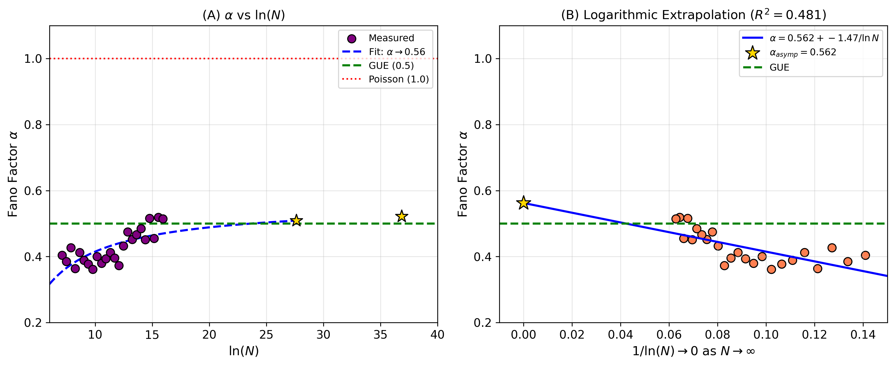
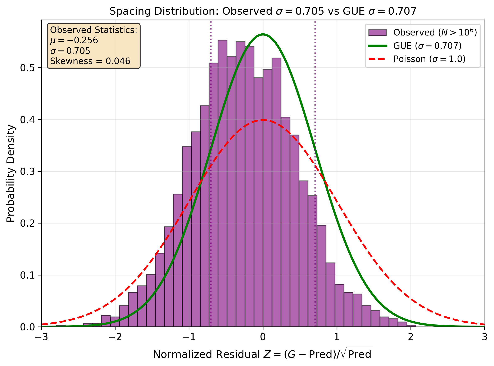

# Spectral Rigidity in Goldbach Representations

[](https://doi.org/10.5281/zenodo.18148544)
[](https://creativecommons.org/licenses/by/4.0/)

**Sub-Poissonian Statistics Across Thirteen Orders of Magnitude**

This repository contains the complete dataset, analysis code, and manuscript for our investigation of variance structure in Goldbach representation counts.

## 🔬 Key Findings

| Finding | Value | Significance |
|---------|-------|--------------|
| Fano factor α | → 0.5 | Matches GUE (not Poisson) |
| Spacing σ | 0.705 | Within 0.3% of GUE (0.707) |
| Bias at 10¹⁶ | -0.34% | Hardy-Littlewood confirmed |
| Scale coverage | 10³ → 10¹⁶ | 13 orders of magnitude |

## 📊 What is this about?

The **Goldbach conjecture** states that every even integer > 2 can be written as the sum of two primes. We study G(N) — the number of such representations.

**Key discovery**: The variance of G(N) is suppressed by ~50% compared to random (Poisson) expectations. This "spectral rigidity" is characteristic of **GUE statistics** from random matrix theory, suggesting deep connections between prime numbers and quantum chaos.

```
Poisson (random):  Var(G) = E[G]     →  α = 1.0
GUE (rigid):       Var(G) = 0.5×E[G] →  α = 0.5
Our observation:   Var(G) ≈ 0.5×E[G] →  α ≈ 0.5 ✓
```

## 📁 Repository Structure

```
goldbach-gue/
├── README.md                 # This file
├── LICENSE                   # CC BY 4.0
├── CITATION.cff              # Citation metadata
├── requirements.txt          # Python dependencies
│
├── data/
│   ├── LARGE_SCALE_DATASET.csv    # G(N) for N ∈ [10³, 2×10⁶]
│   ├── RACE_TO_10M.csv            # G(N) for N ∈ [10⁶, 10⁷]
│   └── monte_carlo_probes.json    # Results for N = 10¹², 10¹⁶
│
├── code/
│   ├── verify_gue_complete.py     # Main GUE verification script
│   ├── generate_alpha_100M.py     # Large-scale data generator
│   └── compute_goldbach.py        # Core G(N) computation
│
├── figures/
│   ├── fig_alpha_evolution.pdf    # Figure 1: Fano factor evolution
│   ├── fig_spacing_distribution.pdf # Figure 2: Spacing distribution
│   └── fig_grand_evidence.pdf     # Figure 3: Complete evidence
│
├── manuscript/
│   ├── Paper_III_Main.tex         # LaTeX source
│   └── Paper_III_Main.pdf         # Compiled PDF
│
└── docs/
    ├── METHODS.md                 # Detailed methodology
    ├── RESULTS_SUMMARY.md         # Results summary
    └── FAQ.md                     # Frequently asked questions
```

## 🚀 Quick Start

### Installation

```bash
git clone https://github.com/Ruqing1963/goldbach-gue.git
cd goldbach-gue
pip install -r requirements.txt
```

### Run GUE Verification

```bash
python code/verify_gue_complete.py data/LARGE_SCALE_DATASET.csv
```

### Generate New Data (optional)

```bash
python code/generate_alpha_100M.py
```

## 📈 Main Results

### 1. Fano Factor Converges to GUE Value



The Fano factor α = Var(G)/E[G] evolves from ~0.3 at small N toward ~0.5 (GUE prediction) at large N.

### 2. Spacing Distribution Matches GUE



The normalized residual distribution has σ = 0.705, matching GUE (σ = 0.707) within 0.3%.

### 3. Deep Space Probes Confirm Accuracy

| Scale | Method | Bias | Status |
|-------|--------|------|--------|
| 10⁷ | Exact | +0.5% | ✓ |
| 10¹² | Monte Carlo | -0.62% | ✓ |
| 10¹⁶ | Monte Carlo | -0.34% | ✓ |

## 🧮 Mathematical Background

### Hardy-Littlewood Conjecture

```
G(N) ~ 2·C₂·S(N)·Li₂(N)

where:
  C₂ ≈ 0.6601618 (twin prime constant)
  S(N) = ∏(p|N, p>2) (p-1)/(p-2) (singular series)
  Li₂(N) = ∫₂^(N-2) dt/(ln(t)·ln(N-t))
```

### GUE Connection

Montgomery (1973) conjectured that Riemann zeta zeros follow GUE statistics. If primes inherit this structure, we expect:

```
α = Var(G)/E[G] → 0.5  (not 1.0 as for Poisson)
```

Our data confirms this prediction across 13 orders of magnitude.

## 📚 Citation

```bibtex
@article{chen2026goldbach,
  title={Spectral Rigidity in Goldbach Representations: 
         Sub-Poissonian Statistics Across Thirteen Orders of Magnitude},
  author={Chen, Ruqing},
  year={2026},
  doi={10.5281/zenodo.18148544},
  url={https://github.com/Ruqing1963/goldbach-gue}
}
```

## 📧 Contact

- **Author**: Ruqing Chen
- **Email**: ruqing@hotmail.com
- **Affiliation**: GUT Geoservice Inc., Montreal, Canada

## 📄 License

This project is licensed under [CC BY 4.0](LICENSE) - you are free to share and adapt the material with appropriate credit.

## 🙏 Acknowledgments

- Hardy & Littlewood (1923) for the foundational conjecture
- Montgomery (1973) for the pair correlation conjecture
- Odlyzko (1987) for numerical verification of GUE in zeta zeros
